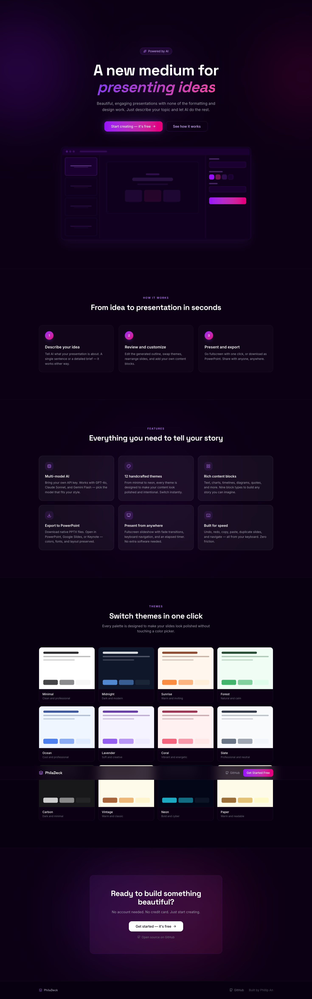
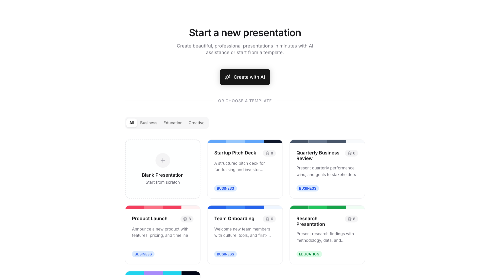
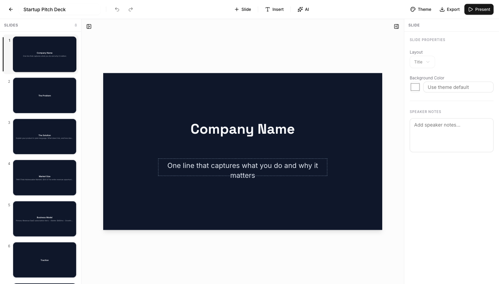
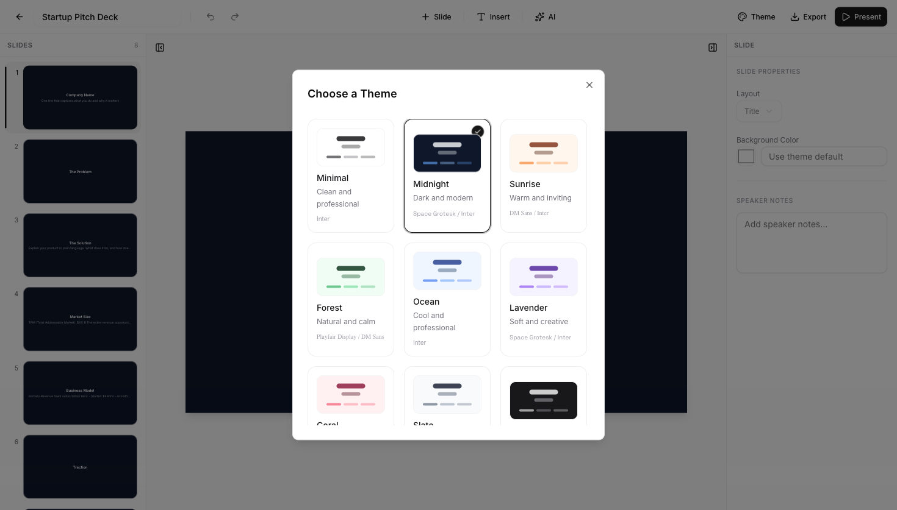

# PhilaDeck

**AI-powered presentation maker.** Create beautiful slide decks in seconds -- no signup required.

[Live Demo](https://philadeck.vercel.app) · [Report Bug](https://github.com/phillipan14/philadeck/issues) · [Request Feature](https://github.com/phillipan14/philadeck/issues)

---

## Screenshots

| Landing Page | Template Gallery |
|:---:|:---:|
|  |  |

| Slide Editor | Theme Selector |
|:---:|:---:|
|  |  |

---

## Features

- **AI-Powered Generation** -- Describe your topic, review an editable outline, then generate a full deck. Supports GPT-4o, Claude Sonnet, and Gemini Flash.
- **12 Built-in Themes** -- Minimal, Midnight, Sunrise, Forest, Ocean, Lavender, Coral, Slate, Carbon, Vintage, Neon, and Paper. Switch instantly with one click.
- **8 Content Block Types** -- Text, images, bullet/numbered/checklists, bar/line/pie/donut charts, timelines, diagrams (cycle, pyramid, funnel, flowchart, Venn), quotes, and icon grids.
- **10 Slide Layouts** -- Title, title + content, two-column, three-column, comparison, content + image (left/right), full-bleed image, section header, and blank.
- **PPTX Export** -- Download native PowerPoint files compatible with Google Slides and Keynote. Theme colors, fonts, and positioning are preserved.
- **Presentation Mode** -- Fullscreen slideshow with keyboard navigation, fade transitions, elapsed timer, and slide counter.
- **Undo / Redo** -- 50-step history stack. `Cmd+Z` to undo, `Cmd+Shift+Z` to redo.
- **Drag-and-Drop Reordering** -- Rearrange slides in the sidebar via drag and drop (dnd-kit).
- **Image Search** -- Built-in Unsplash integration. Search and insert high-quality photos without leaving the editor.
- **Rich Text Editing** -- Inline editing powered by Tiptap with alignment, color, underline, and placeholder support.
- **Offline-First** -- All data persists in localStorage with 2-second debounced auto-save. No account, no database.
- **Keyboard Shortcuts** -- `Cmd+Z`, `Cmd+Shift+Z`, `Cmd+D` (duplicate slide), `Cmd+C/V` (copy/paste blocks), arrow keys (navigate slides), `Tab` (cycle blocks), `Escape` (deselect).

## Tech Stack

| Layer | Technology |
|-------|------------|
| Framework | Next.js 15 (App Router) |
| Language | TypeScript |
| UI | shadcn/ui, Radix primitives, Tailwind CSS 4 |
| State | Zustand + Immer (immutable updates with undo/redo) |
| AI | Vercel AI SDK -- OpenAI, Anthropic, Google providers |
| Rich Text | Tiptap |
| Charts | Recharts |
| Export | PptxGenJS |
| Drag & Drop | dnd-kit |
| Images | Unsplash API |
| Validation | Zod |

## Quick Start

**Prerequisites:** Node.js 18+ and npm (or pnpm / yarn).

```bash
# Clone the repository
git clone https://github.com/phillipan14/philadeck.git
cd philadeck

# Install dependencies
npm install

# Start the dev server
npm run dev
```

Open [http://localhost:3000](http://localhost:3000) and click **Create Presentation**.

## AI Setup

PhilaDeck supports three AI providers. API keys are entered in the app's settings panel and stored in your browser's localStorage -- they are never sent to any server other than the provider's own API.

1. Click the **Settings** (gear) icon in the AI prompt modal.
2. Select your provider: **OpenAI**, **Anthropic**, or **Google**.
3. Paste your API key.
4. Done. The key persists across sessions.

| Provider | Model | Get a key |
|----------|-------|-----------|
| OpenAI | `gpt-4o` | [platform.openai.com](https://platform.openai.com/api-keys) |
| Anthropic | `claude-sonnet-4-20250514` | [console.anthropic.com](https://console.anthropic.com/) |
| Google | `gemini-2.0-flash` | [aistudio.google.com](https://aistudio.google.com/apikey) |

## Deploy

Deploy your own instance with one click:

[](https://vercel.com/new/clone?repository-url=https://github.com/phillipan14/philadeck)

Optionally set the `UNSPLASH_ACCESS_KEY` environment variable to enable image search. Without it, image blocks fall back to placeholder graphics.

## Project Structure

```
src/
├── app/
│   ├── api/ai/          # AI generation routes (outline, slides, redesign)
│   ├── api/images/      # Unsplash image search proxy
│   ├── editor/[id]/     # Slide editor page
│   ├── present/[id]/    # Fullscreen presentation mode
│   └── page.tsx         # Landing page
├── components/
│   ├── ai/              # Prompt modal, model selector, outline editor, API key settings
│   ├── editor/          # Canvas, toolbar, slide panel, property panel, content blocks
│   ├── export/          # PPTX export modal
│   ├── images/          # Image search modal and grid
│   ├── present/         # Presenter view
│   ├── theme/           # Theme selector
│   └── ui/              # shadcn/ui primitives
├── hooks/               # useAutoSave, useKeyboardShortcuts
├── lib/
│   ├── ai/              # Provider config, Zod schemas, prompt templates
│   ├── export/          # PPTX and PDF export logic
│   ├── images/          # Unsplash client
│   ├── themes/          # 12 theme presets
│   └── storage.ts       # localStorage persistence
├── stores/              # Zustand presentation store (undo/redo, copy/paste)
└── types/               # TypeScript interfaces (Presentation, Slide, ContentBlock, Theme)
```

## License

MIT -- see [LICENSE](LICENSE) for details.
